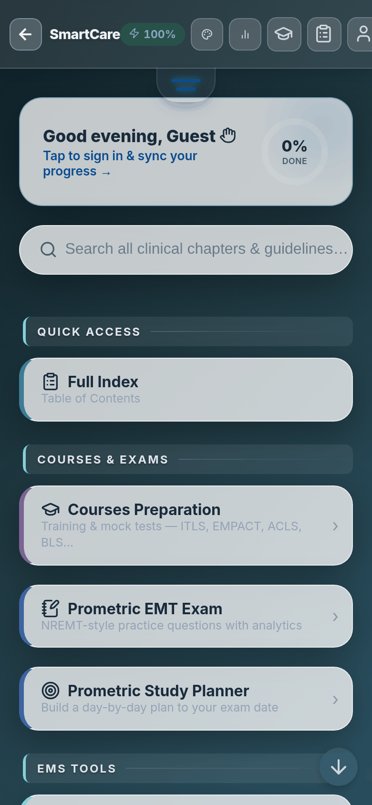
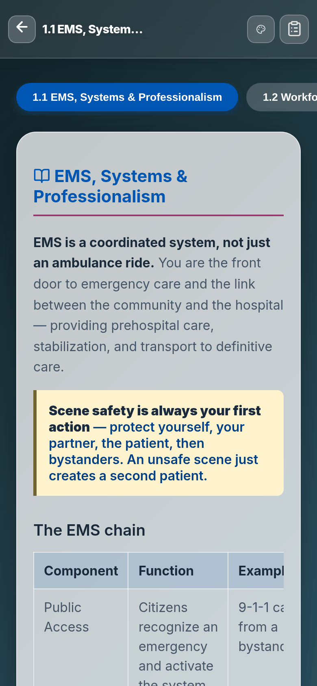
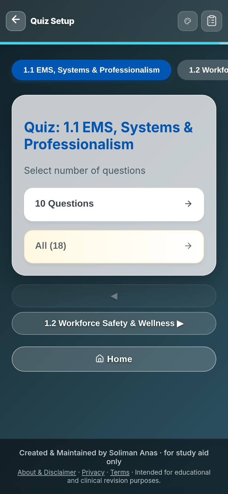

# SmartCare — Clinical Learning Platform

<p align="center">
  
  &nbsp;&nbsp;
  
  &nbsp;&nbsp;
  
</p>

<p align="center">
  <strong>A secure, offline-first Progressive Web Application for healthcare professionals.</strong><br/>
  Study guidelines, practice flashcards, take quizzes, and simulate ECG rhythms — all without an internet connection.
</p>

<p align="center">
  <a href="https://github.com/SolimanAnas/SmartCare/blob/main/LICENSE"></a>
  
  
  
  
  
</p>

---

## Highlights

| | |
|---|---|
| **21 Study Modules** | BLS, ACLS, PALS, ITLS, BDLS, PEPP, EMPACT, Medical Emergencies, Prometric Exam, ECG Course & Simulator, Drug Calculator — and dedicated course reviewers for each. |
| **100% Offline** | Service Workers cache all content. Study in elevators, ambulances, or rural clinics with zero connectivity. |
| **Zero Framework Bloat** | Vanilla JS + raw CSS. No React, no build pipeline — instant render on any device. |
| **Dark-Mode Native** | 5 themes including a true AMOLED Black for battery conservation on OLED screens. |
| **Secure by Design** | Google OAuth 2.0, encrypted sessions, rate-limited API, and a structured audit log. |

---

## Course Catalog

| Module | Full Title | Items |
|--------|-----------|-------:|
| 🫀 **BLS** | Basic Life Support | 284 |
| ❤️ **ACLS** | Advanced Cardiovascular Life Support | 33 |
| 👶 **PALS** | Pediatric Advanced Life Support | 57 |
| 🚑 **ITLS** | International Trauma Life Support | 455 |
| 🌪️ **BDLS** | Basic Disaster Life Support | 40 |
| 🧸 **PEPP** | Pediatric Education for Prehospital Professionals | 200 |
| ⚕️ **EMPACT** | Emergency Medical Patients: Assessment, Care & Transport | 50 |
| 💊 **Medical** | Medical Emergencies Review | 45 |
| 📋 **Prometric** | Prometric Mock Exam | 879 |
| 🫀 **ECG Course** | The Ultimate ECG Course | — |
| 📉 **ECG Sim** | ECG Rhythm Simulator | — |
| 📈 **ECG Test** | ECG Rhythm Test | — |

Each course includes **chapters**, **flashcards**, **quizzes**, **clinical scenarios**, **algorithms**, and **reference tables**. Dedicated reviewer modules are available for BLS, ACLS, PALS, BDLS, PEPP, EMPACT, and Medical.

---

## Features

### Authentication & Access Control
- **Google OAuth 2.0** — single-tap login via Supabase.
- **Email / Password** — Werkzeug-hashed credentials.
- **IT Admin Console** — protected dashboard for monitoring registered users and professional levels (Physician, Paramedic, EMT).

### Interactive Learning Engine
- **Chapter Summaries** — structured, scrollable study material with expand/collapse states.
- **Flashcards** — spaced-repetition–style self-quizzing.
- **Quizzes & Scenarios** — timed assessments with accuracy tracking and clinical simulation.
- **ECG Simulator** — real-time rhythm rendering for pattern recognition practice.
- **Drug Calculator** — medication dose, drip rate, and infusion calculations.

### Offline-First PWA
- **Service Worker** caching for all assets, guidelines, and UI.
- **Instant load** via local storage rendering.
- **OTA cache refresh** — new content pushes seamlessly.

### User Experience
- **5 themes** — Dark, Light, Sepia, Forest, AMOLED Black.
- **Session memory** — remembers scroll position, expand states, and last visited protocol.
- **Progress tracking** — chapter completion, quiz accuracy, and attempt counts cached locally.
- **Dynamic font scaling** and battery-level monitoring.

---

## Architecture

```
SmartCare/
├── server.py              # Flask app — static serving, rate limiting, account deletion API
├── sw.js                  # Service Worker — offline caching layer
├── app.js                 # Core client-side application logic
├── styles.css             # Global stylesheet (glassmorphism design system)
├── manifest.json          # PWA manifest
├── precache-manifest.js   # Auto-generated cache asset list
├── src/                   # Course content & specialized modules
├── courses/               # Course reviewer modules (BLS, ACLS, PALS, etc.)
├── data/                  # Course catalog & static data
├── pages/                 # Sub-pages (admin, drug calculator, etc.)
├── scripts/               # Build & deploy utilities
├── tests/                 # Playwright + pytest test suites
└── supabase/              # Edge Functions (admin API)
```

---

## Tech Stack

| Layer | Technology |
|-------|-----------|
| **Backend** | Python 3.10+, Flask 3.x, Gunicorn |
| **Auth** | Google OAuth 2.0, Supabase Auth, Flask sessions |
| **Security** | Flask-Limiter (rate limiting), Werkzeug password hashing, structured audit logging |
| **Frontend** | HTML5, CSS3 (glassmorphism), Vanilla JavaScript (ES6+) |
| **PWA** | Service Workers, Cache API, Web App Manifest |
| **Testing** | Playwright (E2E), pytest (API/integration), ESLint, Ruff, Bandit, pip-audit |
| **Database** | Supabase (PostgreSQL) — no local DB required |
| **Deployment** | Gunicorn + Procfile (Render, Railway, or any WSGI host) |

---

## Getting Started

### Prerequisites

- Python 3.10 or higher
- [Supabase](https://supabase.com) project (for authentication)

### Local Development

```bash
# Clone the repository
git clone https://github.com/SolimanAnas/SmartCare.git
cd SmartCare

# Create a virtual environment
python -m venv venv
venv\Scripts\activate          # Windows
# source venv/bin/activate     # macOS / Linux

# Install dependencies
pip install -r requirements.txt

# Set environment variables (see .env.example)
export SECRET_KEY=$(python -c "import secrets; print(secrets.token_hex(32))")

# Start the server
python server.py               # http://localhost:8899
```

Or on Windows, double-click **`server.bat`** to launch and open the app automatically.

### Running Tests

```bash
SECRET_KEY=test python -m pytest tests/ -v
```

---

## Production Deployment

```bash
# Set environment variables
export APP_ENV=production
export SECRET_KEY=<your-secret>
export SUPABASE_URL=<your-supabase-url>
export SUPABASE_SERVICE_ROLE_KEY=<your-service-role-key>
export RATELIMIT_STORAGE_URI=redis://<your-redis-url>

# Run with Gunicorn
gunicorn server:app --bind 0.0.0.0:8899
```

Or deploy via the included **`Procfile`** to any platform that supports it (Render, Railway, Heroku, etc.).

See [DEPLOYMENT.md](DEPLOYMENT.md) for full configuration details.

---

## Security

SmartCare follows secure development best practices. Security controls include:

- **CI/CD pipeline** — Ruff, Bandit (SAST), pip-audit (dependency scanning), ESLint, and access-control regression tests run on every push.
- **Secrets management** — all credentials injected via environment variables; `.env` is gitignored.
- **Rate limiting** — API endpoints protected via Flask-Limiter with configurable storage backend.
- **Audit logging** — structured JSON audit trail for authentication and admin events.

To report a vulnerability, see [SECURITY.md](SECURITY.md).

---

## License

All rights reserved. This software and its course content are proprietary.
See [LICENSE](LICENSE) for details.

Copyright (c) 2025 Soliman Anas
